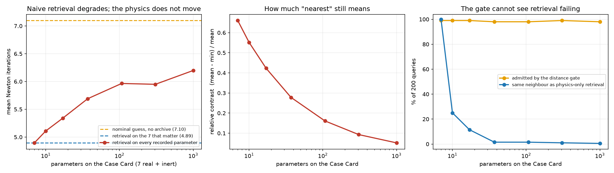

# Déjà Solve

Warm-start a solver's initialisation from the physically-nearest case it has
already solved, instead of starting from zero every time.

Siemens Summer School 2026 · domain: *Digital Twins & Platforms*

- [DEJA_SOLVE_PLAN.md](DEJA_SOLVE_PLAN.md) — the plan, the pitch and the presentation notes
- [phases/](phases/) — what was actually built in each phase, and what was rejected
- [docs/architecture.md](docs/architecture.md) — the two services that exist, what each layer becomes at scale, and what is not built

## Reproduce every number

```bash
python run_all.py
```

Writes `archive/cases.jsonl`, `archive/failures.jsonl`, `results.json`,
`surrogate_results.json`, `surrogate_fold_results.json`,
`failure_zone_results.json`, `dimensionality_results.json` and the figures
in `figs/`.
Runs in a few seconds. No number in the deck is typed by hand — if it is not in
`results.json`, it does not go on a slide.

It ends by printing the **Phase 1 summary hash** — `830da3e6a4480676` — over the
quotable part of `results.json`, skipping timings and the timestamp so it is
stable across runs and machines. If that string changes, a number on a slide
changed with it. Ingest is scored on the parser alone by default; add
`--score-models` to score the local model too (minutes per prose artifact).

Requires Python 3.11+, numpy and matplotlib (`pip install -r requirements.txt`).

## What is here

| file | what it does |
|---|---|
| `model.py` | The physics: a hydraulic manifold driving two motors against Stribeck friction. 7 nonlinear equations, analytic Jacobian, damped Newton, dynamic stability |
| `sweep.py` | Runs a 400-case parameter sweep. What converged becomes the archive; what failed is kept too, in `archive/failures.jsonl` |
| `bench.py` | On 200 *fresh* cases: solve from a flat start, a nominal guess, the nearest archived case verbatim, and the same case transferred first-order (`model.solution_sensitivity`, `model.transfer_start`). Writes `results.json` |
| `surrogate.py` | The *other* source of a warm start: a quadratic response surface fitted to the archive, predicting a state instead of recalling one. The PhysicsAI arrow, at laptop scale |
| `dimensionality.py` | What happens to retrieval when the Case Card carries hundreds of parameters instead of 7 — and which gate stops working |
| `failure_zone.py` | Are the failed runs worth keeping? Tests whether proximity to a failure predicts anything — with the controls that decide whether it is real |
| `selftest.py` | The invariants everything rests on: the analytic Jacobian against central differences, and hardware defaults that must change nothing |
| `wide_sweep.py` | The same measurement on 25 real parameters and six machine variants — where the hardware rule finally becomes reachable |
| `verifier.py` | Layer 3: decides whether reusing a case is legitimate, and whether the answer is an operating point at all. Verdicts carry a severity — a *risk* the engineer may override, or a *fact* they may not |
| `fold.py` | The circuit variant where a warm start *can* be silently wrong, and the naive-vs-verified experiment |
| `casecard.py` | Layer 1's output record: canonical units, quoted provenance, explicit absence |
| `ingest.py` | Turns a run artifact into a Case Card — deterministic parser, a local model via Ollama, or Claude, all behind one interface |
| `make_logs.py` | Seven messy artifacts — five with exact ground truth, plus two built to trip the verifier |
| `dejasolve.py` | The pipeline: `analyse()` returns a structured trace; the CLI and the service both render it |
| `app.py` + `static/index.html` | **The demo UI** — FastAPI service, single self-contained page |
| `plot_convergence.py` | Draws the Phase 1 figure from `results.json` |
| `run_all.py` | All of it, in order |

## The UI

```bash
python app.py
```

Then open <http://127.0.0.1:8000>. Pick one of the seven artifacts (or drop a file
onto the box), press **Analyse**, and the six pipeline stages resolve in order —
ingest, units, retrieve, verify, solve, admissible — each with its own verdict.
A stage that warns is amber and a stage that blocks is red, because those are
different statements. The header badge reads **395 solved · 5 failed**, because
the archive is two things now, and Retrieve names the nearest *failed* run
alongside the nearest solved one — as two distances, never as a verdict. Under the headline sits the **report**: what happened, what
it means, and — when the verdict is a warning — a name field, a reason field and
**Warm-start anyway**. Accepting a warning appends to the audit trail shown at the
bottom of the page.
The headline is the number, against both baselines: **8 cold / 7 nominal → 3 warm Newton iterations, same answer to 2.3e-13** — the warm start now transfers first-order (§ Result), not verbatim.

An **Evidence** panel used to sit below the pipeline — the measured results,
the three arms, the surrogate arms, the fold circuit's 4-vs-40, the
failure-archive AUC, the dimensionality chart, and the 25-parameter sweep,
read live from the result JSONs by `GET /api/evidence`. It has been pulled
off the live page: a demo showing curated offline benchmark numbers next to a
live pipeline read as more decided than the work deserved. The same
CSS/HTML/JS is kept intact in
[presentation/evidence-section.html](presentation/evidence-section.html) for
reuse in the deck, and `GET /api/evidence` still serves the data behind it.

It is a **service with a page attached**, not a notebook app: the page is a
client of `POST /api/analyse`, which is the same endpoint a Study Manager sweep
would call. `GET /api/health`, `GET /api/samples`, `GET /api/evidence`, and OpenAPI docs at `/docs`
come with it. No secrets needed, and nothing leaves the machine: the page offers
the parser, the local model, and the hybrid of the two. Hosted Claude stays a
valid backend for the API and the CLI but is deliberately absent from the page —
an option that contradicts "your run data stays on your network" is the one
thing on screen an engineer would ask about. With no model reachable at all,
ingest falls back to the parser and the demo still runs.

## The end-to-end run (CLI)

```bash
python dejasolve.py --all
```

Five artifacts — a tidy solver log, an older banner log in SI units, a truncated
log, an English email, a Romanian note — go through ingest, retrieval, the
verifier, a warm solve, and an admissibility check:

```
run-tidy.log      warm_started         8 cold / 7 nominal -> 4 warm iterations
run-legacy.log    warm_started         8 cold / 7 nominal -> 4 warm iterations
run-bigpump.log   warned_not_used      nominal guess, 7 iterations (archive not used)
run-truncated.log refused_incomplete   missing p_crack
```

The half that does not warm-start is the interesting half — and it stops in two
different ways, on one rule: **the engineer decides what to do with a risk; the
system decides what is a fact.**

**Warned** is a risk. The verifier estimated, before any solve, that the transfer
is not legitimate — the 118 L/min pump in `run-bigpump.log` is bigger than
anything the archive was swept over. It says so, does not use the archive, falls
back to the nominal guess so the warning costs nothing, and offers an override:

```bash
python dejasolve.py logs/run-bigpump.log --override --operator you --basis "why"
```

`10 cold / 7 nominal -> 5 warm iterations, same answer to 2.4e-09` — and the
acceptance is recorded, with a name, a reason and a timestamp, in the trace's
audit trail. Here the warning was conservative and the override paid off. That is
the argument *for* warning rather than refusing; what makes it safe is that the
admissibility gate still runs on the result, so an engineer can accept a risky
*start* and still cannot be handed an impossible *answer*.

**Blocked** is a fact, and no flag argues with one. `part-bracket.log` is a
Simcenter 3D / NX Nastran solver log — a different kind of model entirely. Layer 1
reads it (SOL 101, the title, modulus, thickness, element counts) and the stage is
green, because ingest did not fail; the domain gate then stops it at Retrieve,
*before* the unit check, because plausibility is judged against a schema and this
one does not apply.

That artifact earns its place on one line. Its banner reads
`Density ....: 2.70E-09 tonne/mm^3`, and the parser's synonym table maps `density`
onto `rho` — so without a domain check the Case Card records **aluminium as the
hydraulic fluid density**. It reports the near miss instead:

```
would_have_been_mismapped   rho <- 2.70E-09 tonne/mm^3
```

One collision, because this schema has seven fields and one of them shares a name
with a structural log — and no synonym was added to manufacture it. Field names
are domain-scoped, and the count grows with the schema. Nothing here solves,
reads or maps a 3D field: the transfer adapter is the next-steps item, and this
is the boundary being shown rather than crossed.
 A missing hydraulic parameter is named,
the nearest archived case is located on the parameters that *were* stated, its
value is shown — and **not applied**. A misread unit (`7.8 m2` → 7.8e+06 mm²) is
caught as implausible before it reaches retrieval. A converged root on the
friction downslope is reported in full and refused as an operating point.

Every path — including the clean one — ends in a **report**: severity, reason,
and what the system did about it.

**Ingest accuracy** (5 artifacts, 35 fields, scored against ground truth;
inventing a value counts as a miss). `run-bigpump.log` is deliberately *not*
scored — it exists to exercise the verifier, and padding the parser's score with
an easy machine log would move this number for a reason unrelated to ingest:

| | parser | local model | **hybrid** |
|---|---|---|---|
| machine logs (3) | **21/21** | 15/21 | **21/21** |
| prose (English email, Romanian note) | 2/14 | **12/14** | **12/14** |
| total | 23/35 | 27/35 | **33/35 (94%)** |
| invented | 0 | 0 | **0** |

The two fail on *disjoint* inputs — the parser is perfect on machine logs and
scores 0/7 on the Romanian note; the model is the reverse. So the default
backend runs the parser first and calls a model only for the fields it could not
fill. A well-formed log never reaches the model and returns in 1.6 s.

**Ingest has its own verifier.** The local model initially invented 3 values —
answering *"the standard fan curves"* with `c_load = 0.0`. A citation now
supports a number only if it contains a digit, values outside the physical
envelope are dropped, and a missing citation is accepted only when the value's
digits are in the artifact. That took inventions to zero *and* raised the score.

```bash
python ingest.py --compare        # scores every available backend
```

> Runs locally by default (`qwen2.5:7b` via Ollama) — nothing leaves the machine,
> and no internet is needed. The Claude backend is written but **untested** here.
> On a 4 GB GPU a prose artifact takes 1–3 minutes; machine logs are unaffected.

### Before the demo: check the model is actually reachable

The prose artifacts (`note-ro.txt`, `note-email.txt`) are the half of the demo
that needs the model — the deterministic parser scores 0/7 on the Romanian note.
Without it the pipeline still runs and refuses honestly, but the 94% hybrid
result cannot be shown.

```bash
curl http://127.0.0.1:11434/api/tags     # must list qwen2.5:7b
```

If it lists other models but not `qwen2.5:7b`, **do not re-pull it** — check
where Ollama is reading from before downloading 4.7 GB again:

```bash
ollama pull qwen2.5:7b                   # only if the blobs are genuinely absent
```

**The trap, and it cost an hour to pin down:** if the models live somewhere
other than the default store, `OLLAMA_MODELS` must reach the *server process*.
The **tray app does not pass it through** — setting the variable at Windows User
scope, or exporting it in the shell that launches `ollama app.exe`, both leave
the server reading the default directory. The model sits on disk, complete, and
invisible. Restarting the tray app does not help, and neither does signing out.

What works is running the server yourself, so it inherits the variable directly:

```powershell
$env:OLLAMA_MODELS = "E:\ollama\models"; & "$env:LOCALAPPDATA\Programs\Ollama\ollama.exe" serve
```

**That terminal window *is* the server — closing it stops Ollama.** Start it
before the demo and leave it alone. Kill any tray-app instance first, or the port
is already taken.

Newer Ollama builds expose a model-location field in the tray app's settings; if
yours has one, set it there instead and this stops being a per-session ritual.

Two reasons this is worth the paragraph: it fails *silently* — `auto` degrades to
the parser and the prose artifacts simply refuse, which looks like a broken
feature rather than a missing directory — and the error message says
`run 'ollama pull qwen2.5:7b'`, which would waste 4.7 GB re-downloading a model
that is already there. Check `/api/health` first; it reports which backends are
reachable and why.

## The model

```
pump ──┬───────────────────────────── relief valve ──> tank
       │
      [p1]  manifold
       ├─ valve_a ─[p2a]─ MOTOR a ─[p3a]─ return ─> tank
       └─ valve_b ─[p2b]─ MOTOR b ─[p3b]─ return ─> tank
```

Unknowns are `[p1, p2a, p3a, w_a, p2b, p3b, w_b]` — five pressures and two
shaft speeds. Steady state is a 7×7 nonlinear system: flow balance at each
node, torque balance at each shaft. That is the *initialisation problem*, and
warm-starting it does not change the physics of the case — only the guess
handed to Newton.

It is hard for two ordinary reasons: turbulent orifice flow whose slope blows
up as Δp → 0, and Stribeck friction, whose decaying branch has negative slope
and narrows the basin of attraction around the operating point.

Swept per case: pump delivery, both valve areas, both load coefficients, relief
cracking pressure, fluid density.

## Result

400-case archive, 200 fresh query cases, 1-nearest-neighbour retrieval on the
normalised setup vector. Same residual, same Jacobian, same tolerance — the
only thing that differs is the starting guess.

Three starting guesses, not two. **Cold** is the flat start — every node at
tank, every shaft at rest. **Nominal** is what a competent tool defaults to: a
guess built from the case setup alone (`model.nominal_start`), no archive and
no solve. **Warm** is the nearest archived case's converged state.

| | cold (flat) | nominal | warm |
|---|---|---|---|
| mean Newton iterations | 8.3 | 7.1 | 4.9 |
| total iterations | 1631 | 1420 | 953 |
| runs that never converged | 4 / 200 | 0 / 200 | 0 / 200 |

**42% fewer iterations than the flat start, 31% fewer than the nominal guess**,
and the answers agree to 4e-08 bar and 3e-08 rev/min across all 196 cases where
both converged. The 31% is the number that matters — see below.

### The archive knows more than the endpoint

The `warm` column above hands Newton the neighbour's converged state
**verbatim** — the retrieved answer, asserted as the query's answer. That
throws away everything the archived run knows except where it landed. It also
knows the tangent of its own solution: differentiating the converged residual
through the implicit function theorem gives `dx*/dp = -J⁻¹ ∂F/∂p`, cheap to
compute once per card and stored on it (`model.solution_sensitivity`). The
start becomes `x0 = x_j + S_j (p - p_j)` — the neighbour's answer, walked
toward the query — instead of the neighbour's answer standing in for it.

| | warm (verbatim) | + sensitivity | + ranked by predicted error, k=5 |
|---|---|---|---|
| mean Newton iterations | 4.9 | 3.8 | 3.4 |
| **vs nominal** | **31.1%** | **47.1%** | **51.5%** |
| vs the verbatim warm start | — | 23.3% | 29.7% |

Same candidate as `warm` in the middle column — only the transfer changes, so
it isolates what the tangent alone is worth. The right column also lets the
tangent choose *which* card to transfer from, ranked by predicted start error
(`‖S_j Δp‖`, scaled) instead of by parameter distance — which is the actual
question retrieval was a proxy for. **0 answers differ** from the verbatim
column across all three; same tolerance, same agreement to 3e-08 bar.

It costs 392 bytes and 277 µs per card, computed once when the case enters the
archive, and a 7×7 matrix–vector product per query — about 15% of one residual
evaluation. `python selftest.py` checks the analytic `∂F/∂p` against central
differences (worst relative error 3e-08) the same way it checks the Jacobian.

**The 31% still ships as the conservative number** — it is what a verbatim
transfer gets, and every other result in this file (the surrogate comparison,
the dimensionality table, the wide-parameter sweep) is measured against it, so
changing the baseline there would mean re-measuring all of them. The 47%/51.5%
is the newer result, on the base circuit, reported alongside it rather than in
place of it.

### Why there is a third column

Reporting a warm start only against a flat start is exactly the methodological
error [WARP](https://arxiv.org/abs/2605.05728) documents in the warm-start
literature: the baseline is one nobody would ship, so the win is inflated. The
flat start is especially weak *here*, and `model.py` says why — equal pressures
put every orifice on the worst spot of the sqrt curve and zero speed sits in the
Stribeck regularisation. So the nominal arm was added and the headline is
reported against both.

Two claims did not survive it, and both are stated here rather than dropped:

- **The rescues are not the archive's.** All 4 flat-start failures are fixed by
  the nominal guess too, so the archive rescues nothing the case setup could not.
- **A worse Jacobian does not make the archive worth more.** It makes the *flat
  start* worth less. The nominal guess absorbs all of it:

| solver Jacobian | cold failures | nominal failures | warm failures |
|---|---|---|---|
| exact analytic | 4 / 200 | 0 / 200 | 0 / 200 |
| finite difference, `sqrt(eps)` step | 2 / 200 | 0 / 200 | 0 / 200 |
| finite difference, coarse step | 45 / 200 | 0 / 200 | 0 / 200 |

What does survive is the iteration count: ~31% fewer Newton steps than a good
engineering guess, stable across all three Jacobian settings, with the same
answer to 4e-08 bar. That is a smaller claim than "every failure rescued" and
it is the one the numbers support.

The headline still uses the **analytic** Jacobian on purpose: it is the best
case for both baselines, so the advantage measured against them is real.

## The other warm start: a predicted state

Retrieval recalls a real converged state from a *similar* case. A surrogate predicts an
approximate state for *this* case. Both are just an `x0` handed to Newton, and
`surrogate.py` measures the second one on the same 200 queries.

The surrogate is a **quadratic response surface** — 7 normalised parameters → 36
polynomial features → 7 states, ridge least squares, ~40 lines of numpy and no new
dependency. It fits the 395-case archive in 1 ms and predicts in 150 µs. It is
deliberately not good, and deliberately not a nearest-neighbour regressor, which would
have been retrieval wearing a different hat.

**It is not an answer.** Against a solver tolerance of 1e-8, the predicted state's
residual has a median of **8.26** and a worst case of **230**. **0 of 200 predictions
were solutions.**

**It is the best starting guess on the table.**

| arm | converged | total Newton iterations | mean |
|---|---|---|---|
| cold (flat start) | 196 / 200 | 1631 | 8.32 |
| nominal guess | 200 / 200 | 1420 | 7.10 |
| warm — retrieval | 200 / 200 | 979 | 4.89 |
| **predicted — surrogate** | **200 / 200** | **924** | **4.62** |
| verified — prediction, gated | 200 / 200 | 920 | 4.60 |

**34.9% fewer iterations than the nominal guess**, against retrieval's 31% — so the
prediction beats the archive by 5.6%. That is the expected result, not an upset: the
surrogate sees all 395 archived cases for every query and retrieval uses exactly one.
What it costs is the guarantee. Retrieval hands the solver a real converged state of a
real case; the surrogate hands it something that satisfies nothing. They reach the same
answer here only because the solver is what guarantees the answer — which is the whole
argument, stated by the results rather than by the pitch.

The archive still earns its place: the surrogate needed 395 solved cases to exist before
it could be fitted, and retrieval works from run number two.

**Gating the prediction is honest about not helping — here.** A predicted state has no
source case, so the transfer gate does not apply; the admissibility gate does, pointed at
the prediction — *is this even a legal state to start from?* It fires 15 times in 200,
every one a cavitating pressure the polynomial extrapolated. Using those 15 anyway costs
**4 Newton iterations across the whole run**, and none of them failed to converge. On this
circuit the filter is pointless, because the circuit has a unique root everywhere and a
bad start can only cost iterations — it cannot change the answer.

### The circuit where it does matter

```bash
python surrogate.py --fold
```

The fold circuit, where the starting guess selects *which* of three roots Newton finds and
the middle one is dynamically unstable. Same archive and same 200 queries as `fold.py`:

| same circuit, same queries | from **retrieval** | from **prediction** |
|---|---|---|
| naive — valid operating point | 147 | 158 |
| **naive — unstable root, silently wrong** | **4** | **40** |
| naive — no answer at all | 49 | 2 |
| verified — valid operating point | **200** | **200** |
| verified — silently wrong | **0** | **0** |
| verified — total Newton iterations | 1579 | **1300** |

**The prediction is the better starting guess and, unverified, ten times more dangerous.**
200 valid answers for 18% less solver work than retrieval — and 40 silently wrong answers
against retrieval's 4.

The mechanism is worse than the count. Naive retrieval fails to converge 49 times, which is
a loud failure a human goes and investigates. The prediction converges 198 times out of 200,
and 40 of those land at a residual of 1e-8 on an operating point no machine can occupy.
**The surrogate converts loud failures into silent wrongness.**

**And the pre-filter is a cost mechanism, not a safety one.** A third arm — `post_only`, no
check on the prediction, only the gate on the answer plus escalation — also returns 200
valid and 0 wrong, for 1559 iterations against the guarded policy's 1300. Safety comes from
the gate on the *answer*, on both circuits and for both sources; checking the prediction
first is worth nothing on the base circuit and 17% of solver work here. That arm exists so
the easier, false claim cannot be made by accident.

Full record: [phases/phase-1b-surrogate.md](phases/phase-1b-surrogate.md).

## Hundreds of parameters

Real models have hundreds of parameters; this circuit has 7. The useful question
is which layer breaks first when it is not 7 — so the physics stays untouched and
the *recorded* vector grows with entries that are real numbers on the Case Card
and inert in the equations, 7 to 1007. Nuisance entries occupy [0, 1], the same
range the real parameters do after normalisation, which is the favourable case
for naive retrieval.

| Case Card width | mean iterations | vs nominal | same neighbour as physics-only retrieval | contrast |
|---|---|---|---|---|
| 7 (real only) | 4.89 | **31.1%** | 200/200 | 0.661 |
| 37 | 5.69 | 19.9% | 3/200 | 0.278 |
| 107 | 5.96 | 16.0% | 3/200 | 0.161 |
| 1007 | 6.20 | **12.7%** | 1/200 | 0.052 |

**It degrades without collapsing, and that is not a compliment to the index.** At
1007 parameters retrieval still beats the nominal guess by 12.7% — because on this
circuit every archived state is a plausible operating point, so even a random one
beats a formula. The archive is doing the work; the index has stopped
contributing. By **37 recorded parameters** it agrees with physics-only retrieval
on 3 of 200 queries, which is near chance.

**And the distance gate cannot see it.** The coverage rule is re-derived in
whatever space retrieval indexes, so its radius scales correctly — 0.53 to 12.52 —
and it goes on admitting **196–198 of 200 at every width**. It does not fail
loudly; it fails by approving, because the concentration that destroyed the signal
also inflated the radius the distance is checked against.

> A distance threshold cannot detect the failure of a distance metric.

`envelope`, `breakaway` and `relief` read the 7 real parameters and the source's
recorded regime, and are independent of the card's width by construction. That is
the measurement behind the Phase 2 decision to build the gate from cheap physics
rather than a distance threshold.



Full record: [phases/phase-1c-dimensionality.md](phases/phase-1c-dimensionality.md).

## The failed runs are in the archive too

An engineer asked for them, and they were right: the failures were being counted
and thrown away. On the fold circuit that meant discarding **165 runs of 300** —
more than half the compute. `sweep.py` now writes `archive/failures.jsonl`, and
`fold.sweep_fold()` returns its rejects instead of tallying them.

Then the obvious rule was tested rather than assumed — *warn when the nearest
failed case is closer than the nearest successful one*:

| | **will this run die?** | **will reuse go wrong?** |
|---|---|---|
| base rate | 56.0% | 26.5% |
| P(bad \| rule fired) | **74.8%** | 30.4% |
| lift over base rate | **1.34x** | 1.15x |
| **AUC** | **0.770** | 0.633 |

**The control matters more than the result.** Failures cluster where the circuit
is hard, and successes are sparse in the same places — so a positive score could
just mean *"you are far from anything solved"*, which the coverage rule already
sees. Scoring on distance-to-nearest-success alone gives AUC **0.650**; the rule
gives **0.770**. The failed runs carry information the successful ones do not.

**And the rule is still not in the gate.** It predicts whether a *case is hard*
and barely predicts whether a *transfer is legitimate* — different questions, and
the archive answers one of them. So it is advisory information for the engineer
rather than a rule the system acts on. Two more reasons: a 56% base rate means
"this one might die" is not news, and on the base circuit (5 failures in 400) the
rule fires 3 times in 200 and catches none of the 4 hard cases. `failure_zone.py`
prints **UNDERPOWERED** rather than letting that be quoted as evidence.

A failure archive is only worth consulting where runs actually fail.

Full record: [phases/phase-2b-failure-archive.md](phases/phase-2b-failure-archive.md).

## The verifier (Phase 2)

A converged answer can still be wrong. The steady state is the equilibrium of a
dynamic system, and a root on the Stribeck downslope is **dynamically
unstable** — it satisfies the equations to 1e-8 and no machine can sit there.
Newton cannot tell; the eigenvalues can.

The base circuit above has a *unique* root everywhere in its envelope — checked
with a 16-seed multi-start over all 400 cases, not assumed. So it cannot
demonstrate that failure mode. `fold.py` builds the same equations around a
smaller motor (5 cm³/rev), where the operating point falls into the Stribeck
fold and the torque balance picks up three roots.

200 fresh cases on that circuit:

| | naive retrieval | verified |
|---|---|---|
| valid operating point | 147 | **200** |
| **unstable root (silently wrong)** | **4** | **0** |
| no answer | 49 | **0** |
| total Newton iterations | 1571 | **1579** |

**4 silently wrong answers → 0, for +1% solver work.** The gate is built from
physics rather than a distance threshold, because setup distance turned out to
predict transfer cost with r = 0.18 — barely at all.

**It is a gate that argues rather than one that refuses.** Asked whether the
system should refuse when unsure or warn and let them decide, the two engineers
interviewed for this project chose the second — so a verdict carries a severity.
Gate 1 *estimates*, before any solve, and everything it decides is a **warning**
the engineer may override under their own name. Gate 2 *measures*, after the
solve, and what it finds is a **fact** with no override: the equations are
satisfied and no machine runs there. Both always produce a report.

The +1% is recent. When a refused transfer fell back to the flat start this cost
+36%; falling back to the nominal guess instead makes safety almost free. But
the swap is **answer-changing, not just cheaper**, and `fold.py` measures that
rather than footnoting it: **12 of 200 cases resolve to a different operating
point** (max |dw| 789 rev/min). Both are stable and both pass the verifier —
these cases are genuinely bistable. The guarantee is that you never land on an
*impossible* operating point, not that you land on the same valid one a
different starting guess would have found.

### The first-order transfer is safer here, not just cheaper

The base-circuit finding above holds on the harder circuit too — and here the
transfer gate is already in the loop, so it is measured through it rather than
instead of it. `agent_select.py`'s k=5 shortlist evaluation reruns this
comparison with the same gated retrieval, transferring first-order instead of
verbatim:

| arm (gated, k=5) | mean iterations | inadmissible |
|---|---|---|
| verbatim (distance picks, copies) | 7.95 | 11 |
| + sensitivity (distance picks, tangent transfers) | 5.33 | 1 |
| + sensitivity ranked | 5.13 | **1** |

These are the k=5 gated-shortlist numbers, not the k=1 arm in the table above,
so they are not directly comparable line-for-line — see
`agent_select_results.json`. The mechanism is the same one that helps on the
base circuit: a start that lands closer to the true operating point is a start
less likely to overshoot into an unstable one, so cost and correctness improve
together instead of trading off.

## Not done yet

Phase 4 is Docker and the AWS architecture slide. The container needs no
secrets — the full demo runs on the deterministic ingest backend.

The UI shipped in Phase 3 — a FastAPI service with a single-page client, both
clients of `dejasolve.analyse()`, which returns a structured trace. (An earlier
draft of this file said it was deferred; it was not.)
