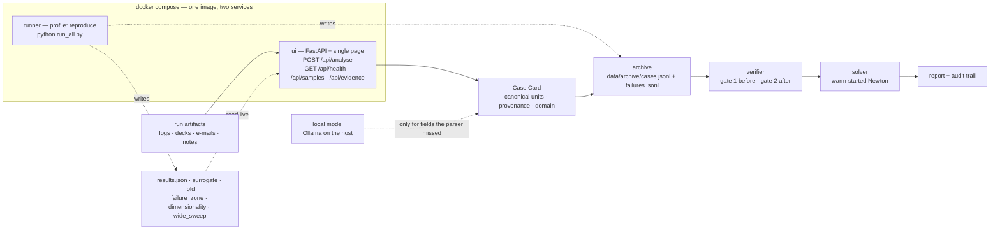

# Architecture — what runs, and what it becomes

Two questions, kept apart on purpose: **what is actually built**, and **what it maps onto at scale**. Mixing
them is how an architecture slide ends up describing software nobody has run.

Everything in *Today* runs with `docker compose up`. Everything in *At scale* is a mapping, not a deployment —
there is no cloud account behind any of it, and the demo has to work in a room with no internet.

---

## Today: one image, two services

**Two services, because two is what is honestly here.** An API that serves verified warm starts, and a
solver-runner that produces the archive it serves from. The compose file says the same thing in a comment: a
queue nothing publishes to is worse than an honest topology.

| | what it is | why it is a container |
|---|---|---|
| **ui** | FastAPI service, single-page client, port 8000 | The pitch is a platform, and what a platform exposes is an API. `POST /api/analyse` is the same endpoint a Study Manager sweep would call. |
| **runner** | `python run_all.py`, profile-gated | Regenerates every number and figure. Profile-gated so `docker compose up` meets its gate — the UI comes up — rather than silently spending a minute re-solving 600 cases. |

**The image is one image.** Single stage, four wheels, non-root, `HEALTHCHECK` on `/api/health`. There is
nothing to compile, and a multi-stage build here would be complexity for its own sake on a slide about
architecture.

**Nothing leaves the machine.** The archive, retrieval, the verifier and every solve are in-process. The one
outbound call is ingest's optional local model, and it goes to the host, never off it — `OLLAMA_URL` is
overridable and unreachable is a supported state that `/api/health` reports.

---

## At scale: the same four layers, different backing services

The layer boundaries do not move. What changes is what sits behind each one.

| Layer | Today | At scale | What forces the change |
|---|---|---|---|
| **1 · Ingest** | in-process parser, optional local model | queue + worker pool (SQS + ECS tasks), artifacts in S3 | Ingest is per-artifact, embarrassingly parallel, and the only slow step. It is also the only component that can call a model, so it is the only one with an egress policy. |
| **2 · Archive + retrieval** | `cases.jsonl` read into memory, O(n) numpy nearest-neighbour over 395 rows | Postgres + pgvector, or OpenSearch; artifacts in S3 | A linear scan is correct and instant at 10³. At 10⁵–10⁶ runs it is neither. **Note the measured caveat**: [phase 1c](phases/phase-1c-dimensionality.md) shows the *metric* degrades long before the *scan* does, so an ANN index makes a failing search faster rather than better. |
| **3 · Verifier** | pure functions over a Case Card and a source record | unchanged — a stateless library, called wherever layer 2 runs | It holds no state and does no I/O. That is the point: it can live in the sweep driver, the API, or a CI check without changing. |
| **4 · Solve** | in-process Newton | Batch/ECS jobs, one per case, results to S3 | This is where the real solver goes, and it is the layer this project deliberately does not replace. Déjà Solve hands it a starting state; it stays whatever the customer already runs. |

**On-premises is the default deployment, not a fallback.** Run artifacts are customer data. Every mapping above
has an equivalent behind a firewall — a queue, a database, an object store, a scheduler — and the layer that
matters never touches a network under any configuration.

---

## What would have to change first

Honest ordering, if this were picked up:

1. **The archive is a file.** `Archive` loads every record into memory at start-up. That is right for 395 cases
   and wrong for the first real customer. Retrieval is already behind a method, so this is a backing-store
   swap rather than a redesign — but it is the first one.
2. **Retrieval indexes the whole setup vector.** [phase 1c](phases/phase-1c-dimensionality.md) measures what
   that costs on a wide Case Card, and [phase 1d](phases/phase-1d-wide-parameters.md) shows the hardware
   parameters doing useful work inside it. Knowing which parameters matter is a physics question, and it is
   the highest-value unbuilt thing.
3. **The transfer operator is state-vector only.** A field mapped between meshes is the adapter that makes this
   work for 3D — see the domain gate refusing exactly that in `data/logs/part-bracket.log`. It is real engineering,
   not configuration.
4. **There is no multi-tenancy.** One archive, one domain, no notion of who may reuse whose results. The
   engineer interview raised it (§8b/Q6) and it was never answered.

## What is not built, stated plainly

- No cloud deployment exists. The table above is a mapping.
- No ANN index, no database, no queue, no object store — a JSONL file and numpy.
- No mesh handling, no field transfer, no structural solving.
- No authentication, no tenancy, no retention policy.
- The hosted-model ingest backend is written and has never executed here.

The reason to write this down rather than draw six boxes: every one of those absences is a question somebody
will ask, and having the list is better than being surprised by it.
